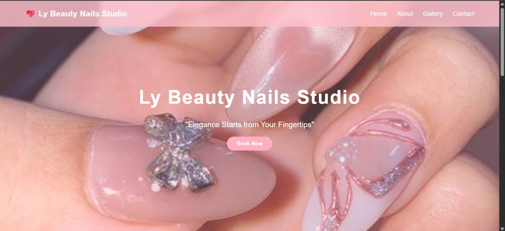

# Website Nail Art - Ly Beauty Nails Studio

> Contoh website sederhana untuk **company profile** studio nail art bernama **Ly Beauty Nails Studio**.  
> Request by **Salsa** | Dibuat oleh [Faraysz](https://github.com/Faraysz)

---

## Deskripsi Proyek

Website statis ini dibuat untuk menampilkan profil bisnis **Ly Beauty Nails Studio**, meliputi:
- Layanan nail art (manicure, pedicure, nail extension, dll)
- Galeri karya sebelum & sesudah
- Informasi lokasi dan jam operasional
- Formulir kontak & WhatsApp
- Integrasi media sosial

Dibangun **tanpa framework**, hanya menggunakan **HTML5** dan **CSS3** murni — cocok untuk pemula atau template bisnis kecil.

---

## Fitur Utama

| Fitur | Deskripsi |
|------|-----------|
| **Responsif** | Tampil sempurna di HP, tablet, dan desktop |
| **Galeri Nail Art** | Showcase karya dengan grid elegan |
| **Smooth Navigation** | Menu dengan efek scroll halus |
| **Form Kontak** | Formulir sederhana (bisa dihubungkan ke Formspree/Google Form) |
| **WhatsApp Button** | Klik langsung chat ke admin |
| **Tema Feminin** | Warna soft pink, putih, dan aksen gold |

---

## Teknologi Digunakan

- **HTML5** – Struktur semantik
- **CSS3** – Flexbox, Grid, Custom Properties, Animasi
- **Google Fonts** – Font elegan (contoh: Playfair Display, Poppins)
- **Font Awesome** – Ikon media sosial & dekorasi

---

## Struktur Folder
